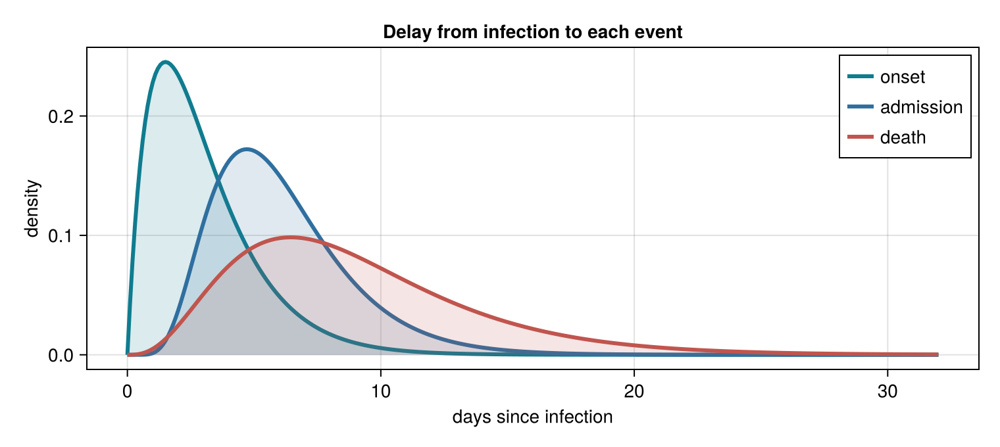
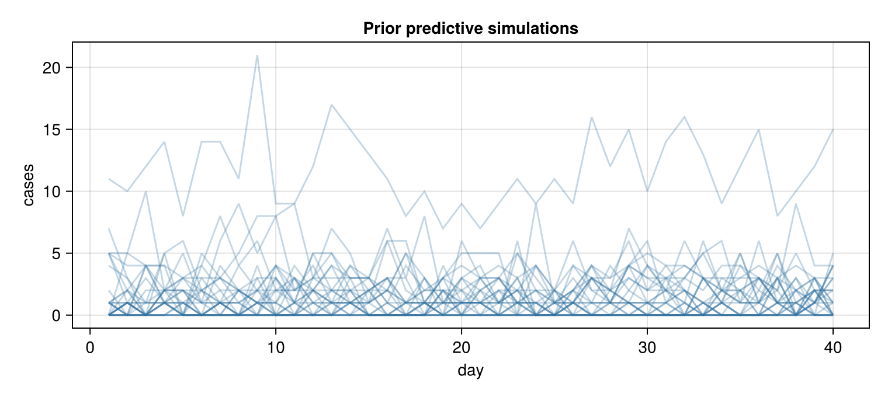

EpiAware is a set of small Julia packages that compose into infectious disease
models. This shows the two ways you work with them: compose the distributions
your data need, and assemble a whole model you can fit. The figures below are
produced by running the code in CI, so they track the current packages.

New to Julia? Start with the [Using Julia](using-julia.qmd) guide.

## Install

Most packages are early and installed from GitHub:

```julia
using Pkg
Pkg.add(url = "https://github.com/EpiAware/ComposedDistributions.jl")
Pkg.add(url = "https://github.com/EpiAware/ComposableTuringIDModels.jl")
```

## Compose delays across events

A case has several delays — from symptom onset to hospital admission, and to
death. `compose` wires named delays into an event tree that prints its own
structure:

```julia
using ComposedDistributions, Distributions

incubation = Gamma(2.0, 1.5)      # infection → onset
admission  = LogNormal(1.0, 0.5)  # onset → admission
death      = Gamma(2.0, 3.0)      # onset → death

onset_to = compose((admission = admission, death = death))
```

```
Parallel (2 branches)
├─ admission: LogNormal{Float64}(μ=1.0, σ=0.5)
└─ death: Gamma{Float64}(α=2.0, θ=3.0)
```

Folding the incubation delay in with `convolved` gives the delay from infection
to each event — and the result is an ordinary distribution you can `pdf`,
`rand`, and plot:

```julia
using CairoMakie

to_onset     = incubation
to_admission = convolved(incubation, admission)
to_death     = convolved(incubation, death)

ts = 0:0.1:32
fig = Figure()
ax = Axis(fig[1, 1]; xlabel = "days since infection", ylabel = "density")
for (d, label) in [(to_onset, "onset"), (to_admission, "admission"),
                   (to_death, "death")]
    lines!(ax, ts, pdf.(d, ts); label, linewidth = 3)
end
axislegend(ax)
fig
```

{fig-alt="Density of the delay from infection to onset, admission, and death"}

## Build and simulate a model

Assemble a model from interchangeable parts — a latent random walk driving
direct infections, observed with Poisson error — with `IDModel`, which also
prints its structure:

```julia
using ComposableTuringIDModels, Distributions

model = IDModel(
    DirectInfections(; Z = RandomWalk(), initialisation_prior = Normal()),
    PoissonError())
```

```
IDModel
├─ infection: DirectInfections
│  └─ Z: RandomWalk
│     └─ ϵ_t: HierarchicalNormal
└─ observation: PoissonError
```

`as_turing_model` turns the assembly into a [Turing](https://turinglang.org)
model. Pass `missing` for the data and it simulates from the prior — here 30
draws of a 40-day outbreak:

```julia
n = 40
simulator = as_turing_model(model, missing, n)
sims = [simulator() for _ in 1:30]   # each has generated_y_t, I_t, Z_t

fig = Figure()
ax = Axis(fig[1, 1]; xlabel = "day", ylabel = "cases")
for s in sims
    lines!(ax, 1:n, s.generated_y_t; color = (:steelblue, 0.28))
end
fig
```

{fig-alt="Thirty prior predictive case trajectories over 40 days"}

To fit real data, pass the case series instead of `missing` and sample:

```julia
turing_model = as_turing_model(model, cases, length(cases))
# 1000 draws across 2 chains, one per core
chain = sample(turing_model, NUTS(), MCMCThreads(), 1_000, 2)
```

## Next

- Browse the [packages](packages/index.qmd) and open each one's documentation.
- Each package's docs include worked examples that go further.
- Ready to contribute or bring a use case? [Get involved](get-involved.qmd).
